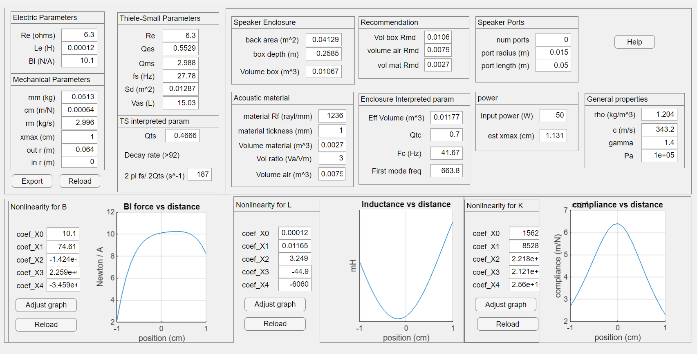

# Loudspeaker Thiele-Small Calculator

## Overview
The Thiele-Small Calculator helps loudspeaker designers to select the component parameters to achieve their design goals. Users can put in the loudspeaker Thiele-Small parameters and the calculator will calculate the components and enclosure parameters.  If a user modify a component parameter the calculator will update the corresponding Thiele-Small parameters.   

Below is a screenshot of the calculator.

## How to get started
Unzip the downloaded file, run the file thieleSmallCalc.mlapp in MATLAB. 

## License
The license is available in the License.txt file in this GitHub repository.

## Relevant Industries
loudspeaker design, loudspeaker drivers, vibration sensor, hydrophones, acoustic transducers, ultrasonic transducers

## Relevant Products
 *  MATLAB®

Copyright 2025 The MathWorks, Inc.
